# Kernel Compilation and Installation Guide

This guide documents the process of compiling and installing a custom Linux kernel from source. The steps cover everything from extracting the kernel source to configuring, building, installing, and updating the bootloader.

## Steps

### 1. **Extract the Kernel Source**

First, extract the kernel source from a `.tar.xz` file. This is done using the `tar` command, which decompresses the kernel source archive into the current directory.

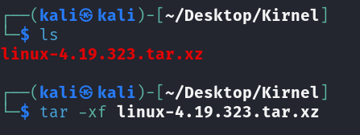

### 2. **Inspect the Makefile**

Next, inspect the `Makefile` in the kernel source directory to check for version and configuration settings. This file contains important variables like `VERSION`, `PATCHLEVEL`, `SUBLEVEL`, and `KERNELVERSION` that determine the kernel version and patch level.

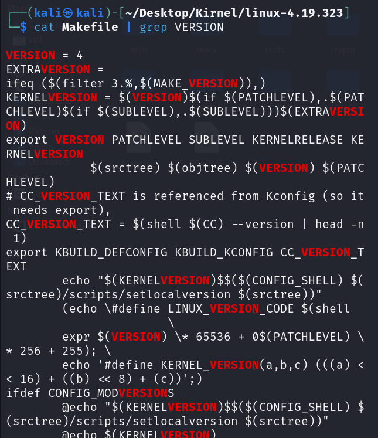

### 3. **View the Kernel Source Tree**

The kernel source directory is organized with several subdirectories for architecture-specific code (`arch/`), drivers (`drivers/`), kernel files (`kernel/`), and documentation (`Documentation/`). These are all crucial for compiling and customizing the kernel.

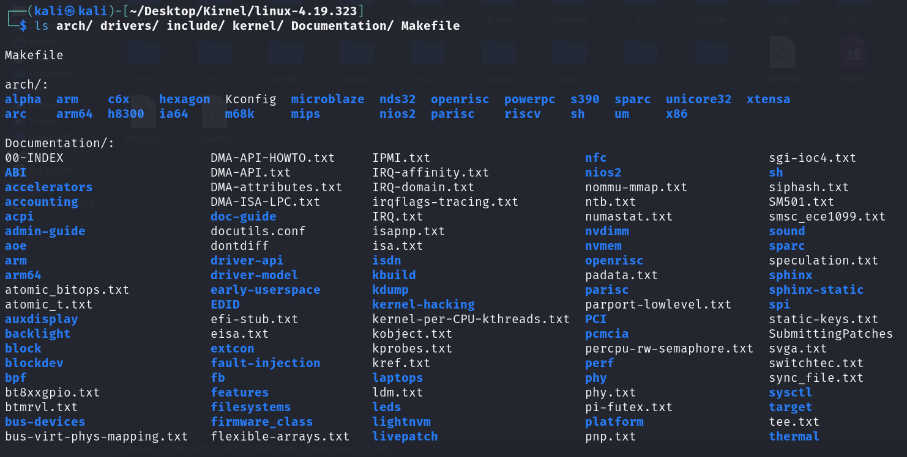

### 4. **Update the Package List**

Before proceeding with the kernel compilation, make sure your system is up to date by running `sudo apt update`. This ensures that the package manager is aware of the latest updates and available packages.

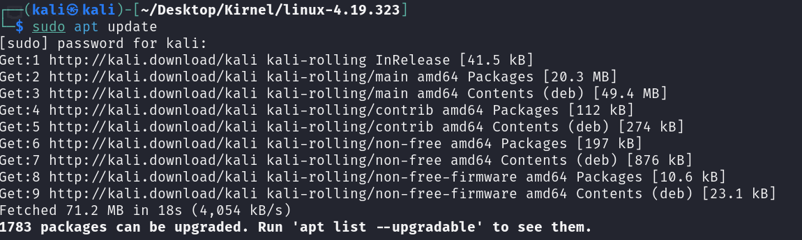

### 5. **Install Dependencies**

The kernel requires several dependencies for building and configuration. These include tools like `build-essential`, `libncurses-dev`, `bison`, and others. Installing these ensures that you have everything needed to configure and compile the kernel.

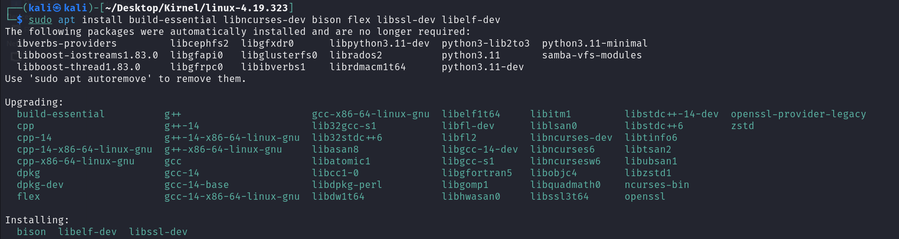

### 6. **Configure the Kernel**

Use `make menuconfig` to configure the kernel. This opens a text-based menu where you can enable or disable various kernel features such as processor type, networking support, and more. It is important to select the right options for your system.

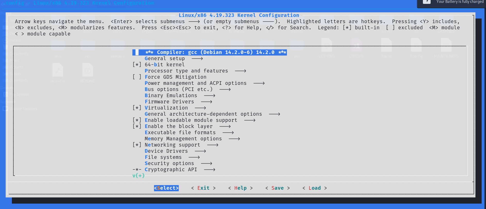

### 7. **Refine the Kernel Configuration**

After opening the configuration menu, navigate through the options and make any necessary adjustments based on your system’s hardware and needs. This step is essential for customizing the kernel.

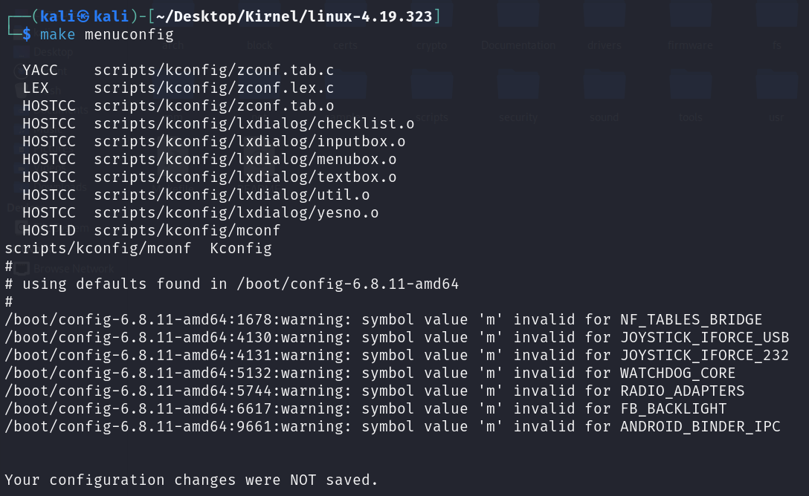

### 8. **Clean the Kernel Build**

Before starting the actual build, run `make clean && make mrproper` to clean up any previous build artifacts. This ensures that the build starts from a fresh state.

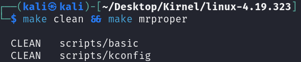

### 9. **Configure Again if Necessary**

If changes are made to the configuration, you can rerun the `make menuconfig` command to refine the settings further.

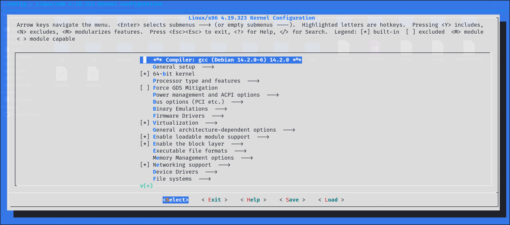

### 10. **Build the Kernel**

Now, you can start the kernel compilation process using the command `make -j$(nproc)`. This command compiles the kernel using all available processor cores, speeding up the build process.

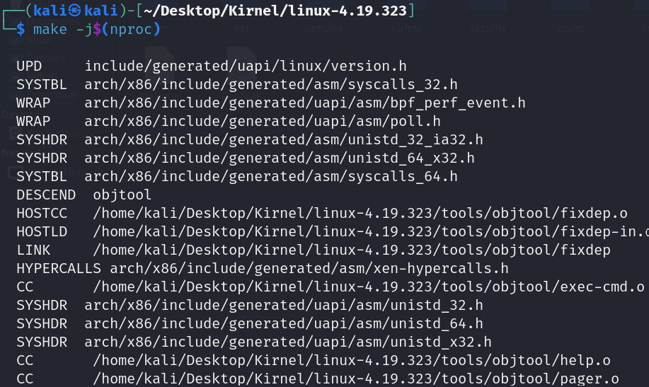

### 11. **Handle Errors**

During the build process, you may encounter missing dependencies or errors. For example, if `bc` (basic calculator) is not installed, it will cause the build to fail. In such cases, install the missing packages.

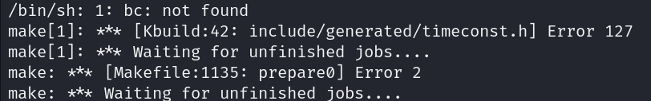

### 12. **Update Package List Again**

After resolving missing dependencies, run `sudo apt update` again to make sure all packages are up-to-date before continuing the build process.

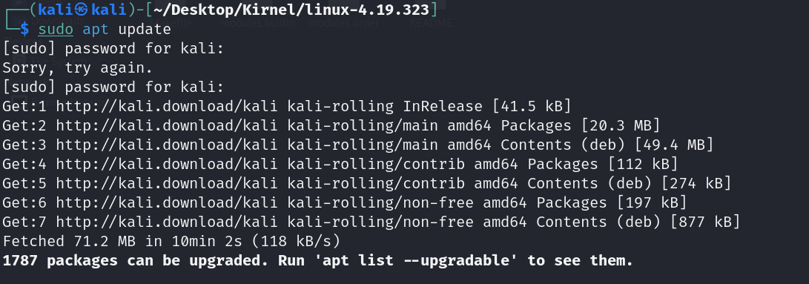

### 13. **Install Missing Dependencies**

If a package like `bc` is missing, install it using `sudo apt install bc`. This resolves the error and allows the build to continue.

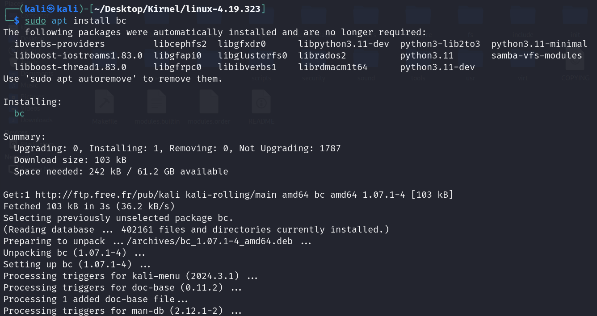

### 14. **Resolve Compilation Warnings**

You may encounter compilation warnings during the build process, such as type conflicts between functions. In this case, the kernel source needs to be fixed to resolve the conflicting definitions.

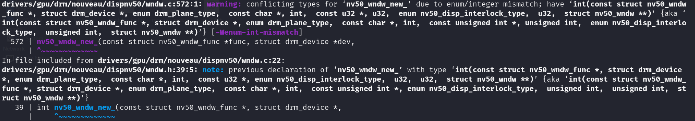

### 15. **Build Kernel Modules**

After the kernel is built, you can build the kernel modules using the `make modules` command. This step builds over 3500 modules that are necessary for various kernel features and hardware support.

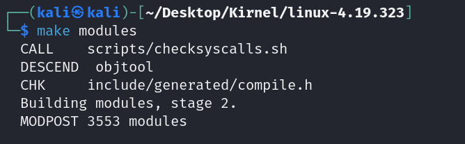

### 16. **Install Kernel Modules**

Once the modules are built, install them using `sudo make modules_install`. This command installs the compiled kernel modules to the system.

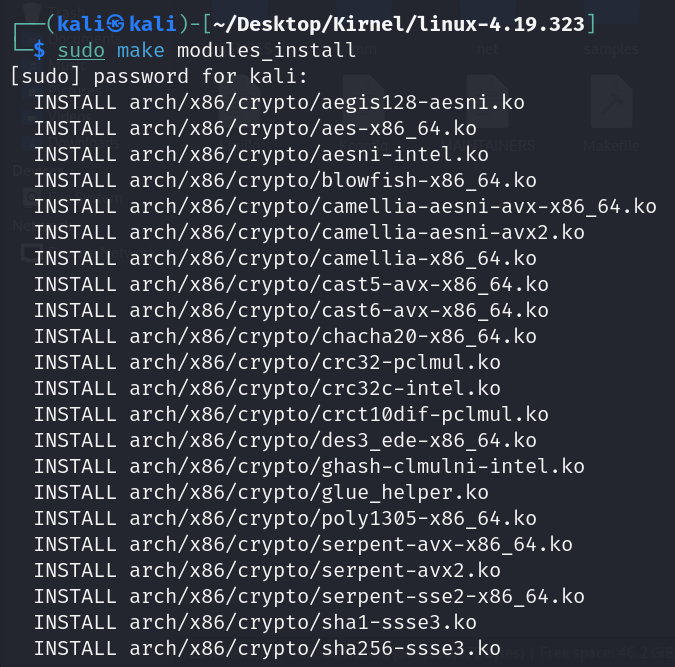

### 17. **Install the Kernel**

To install the newly compiled kernel, run `sudo make install`. This installs the kernel image, `System.map`, and other necessary files into the `/boot/` directory.

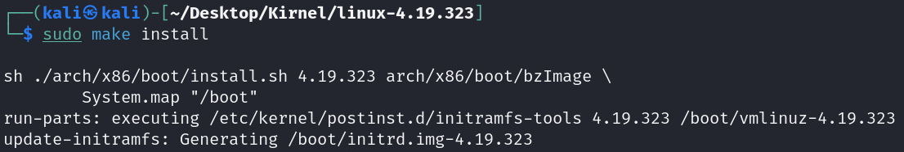

### 18. **Update GRUB Bootloader**

After installing the kernel, update the GRUB bootloader to include the new kernel by running `sudo update-grub`. This command regenerates the GRUB configuration file and adds entries for the new kernel.

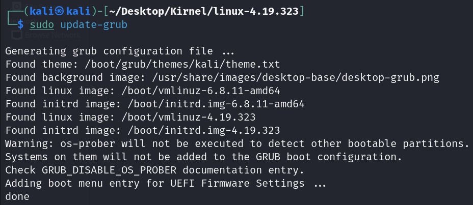

### 19. **Select the Kernel in GRUB**

Finally, when you reboot the system, you will see the GRUB bootloader menu. This menu allows you to select which kernel to boot into: the old kernel or the newly compiled kernel.

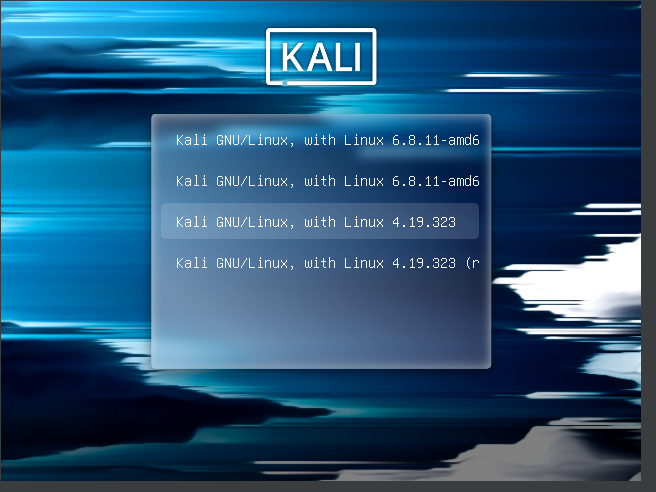

## Conclusion

This process outlines the steps involved in compiling and installing a custom Linux kernel. By extracting the kernel source, configuring it, and building it with the necessary dependencies. Once the kernel is built and installed, updating the bootloader ensures that the new kernel is available during system boot.

